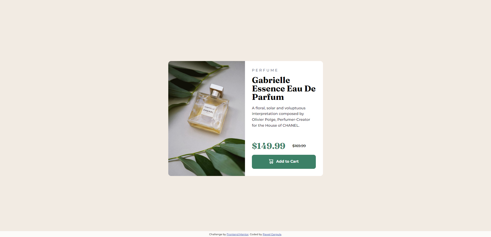

# Frontend Mentor - Product preview card component solution

This is a solution to the [Product preview card component challenge on Frontend Mentor](https://www.frontendmentor.io/challenges/product-preview-card-component-GO7UmttRfa). Frontend Mentor challenges help you improve your coding skills by building realistic projects. 

## Table of contents

- [Overview](#overview)
  - [The challenge](#the-challenge)
  - [Screenshot mobile](#screenshot-mobile)
  - [Screenshot desktop](#screenshot-desktop)
  - [Links](#links)
- [My process](#my-process)
  - [Time to complete](#time-to-complete)
  - [Built with](#built-with)
  - [What I learned](#what-i-learned)
- [Author](#author)

## Overview
Product preview card component challenge

### The challenge

Users should be able to:

- View the optimal layout depending on their device's screen size
- See hover and focus states for interactive elements

### Screenshot mobile

### Screenshot desktop

### Links

- Solution URL: [Add solution URL here](https://github.com/PawelGargula/product-preview-card-component)
- Live Site URL: [Add live site URL here](https://pawelgargula.github.io/product-preview-card-component/)

## My process

### Time to complete

Made it in about 10 hours

### Built with

- Semantic HTML5 markup
- CSS custom properties
- Flexbox
- Mobile-first workflow

### What I learned

It is worth to focus on planing before start codeing

## Author

- Github - [Paweł Gargula (Ojci3c)](https://github.com/PawelGargula)
- Frontend Mentor - [@PawelGargula](https://www.frontendmentor.io/profile/PawelGargula)
